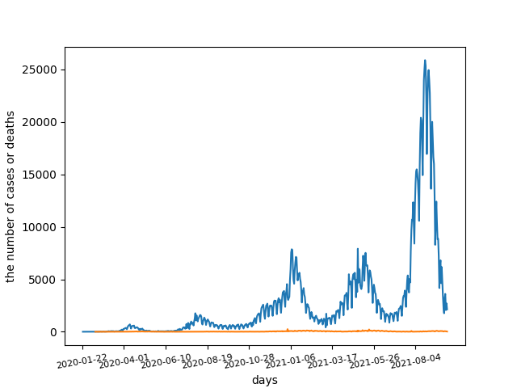
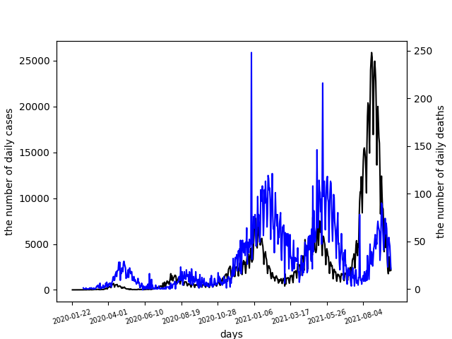
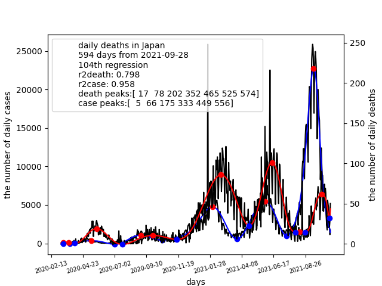

# covid_cases
The following link shows a owid-covid-data.csv file:

https://raw.githubusercontent.com/owid/covid-19-data/master/public/data/owid-covid-data.csv

<pre>
1. Draw a graph of Japan on daily cases using the last 200 days 
   from today with owid-covid-data.csv. 
2. Draw a single-axis graph with two lines of daily cases 
   and daily deaths using the last 200 days from today in Japan.
3. Draw a dual-axis graph with daily cases and daily deaths 
   lines: left axis for daily cases, right axis for daily deaths.
4. Draw a dual-axis graph with daily cases and daily deaths lines
   with curve-fitting lines respectively.
5. Draw a dual-axis graph with extreme points (max and min points)
6. Draw a dual-axis graph with extreme points using ticks and legend.

Hints:
cases=d[d.location=='Japan']['new_cases']

fig,ax1 = plt.subplots()
x1.set_xticklabels(...)
ax1.set_xlabel(...)
ax1.set_ylabel(...)
ax1.plot(...)
ax2=ax1.twinx()
ax2.set_xlabel(...)
ax2.set_xticks(...)
ax2.set_xticklabels(...)
ax2.set_ylabel(...)
ax2.plot(...)
plt.savefig(...)

from scipy import signal
signal.argrelmax(...)
signal.argrelmin(...)

handles,labels = ax1.get_legend_handles_labels()
handles.append(...)
plt.legend(handles=handles)

 
 

</pre>
